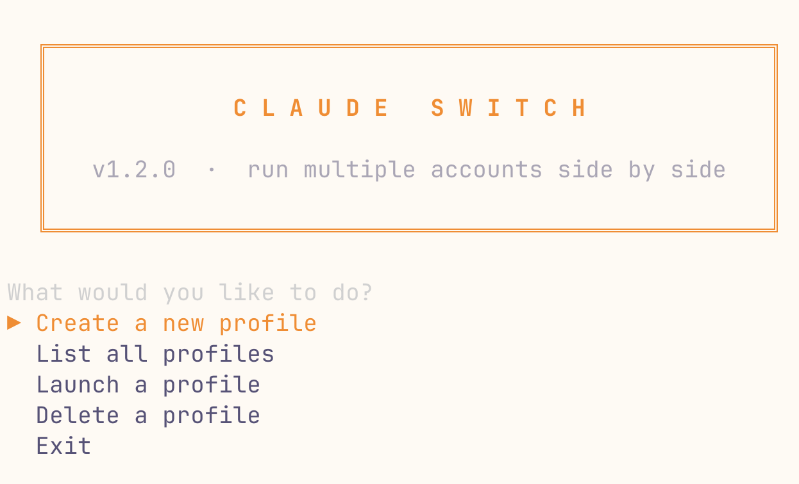

<div align="center">

# Claude Switch

**Run your work and personal Claude Code accounts side by side.**

One machine. Multiple logins. Zero friction.

[](LICENSE)
[]()
[]()
[](https://docs.anthropic.com/en/docs/claude-code)



</div>

---

## The Problem

Claude Code stores one login per machine. If you have a **work account** (Team/Enterprise) and a **personal account** (Pro/Max), you have to `/logout` and `/login` every time you switch. That gets old fast.

## The Fix

```bash
claude-switch work        # launches Claude with your work account
claude-switch personal    # launches Claude with your personal account
```

That's it. Both can run in separate terminals, simultaneously.

---

## Install

```bash
curl -fsSL https://raw.githubusercontent.com/SaschaHeyer/claude-switch/main/install.sh | sh
```

Or with Homebrew:

```bash
brew install gum  # required dependency
curl -fsSL https://raw.githubusercontent.com/SaschaHeyer/claude-switch/main/install.sh | sh
```

<details>
<summary><strong>Manual install</strong></summary>

```bash
# Download
curl -fsSL https://raw.githubusercontent.com/SaschaHeyer/claude-switch/main/claude-switch \
  -o ~/.local/bin/claude-switch

# Make executable
chmod +x ~/.local/bin/claude-switch

# Install gum for interactive UI
brew install gum
```

</details>

<details>
<summary><strong>Uninstall</strong></summary>

```bash
curl -fsSL https://raw.githubusercontent.com/SaschaHeyer/claude-switch/main/install.sh | sh -s -- uninstall
```

</details>

---

## Quick Start

### 1. Create profiles

```bash
claude-switch create work
claude-switch create personal
```

### 2. Launch Claude with a profile

```bash
claude-switch work
```

Claude opens with that profile's account. On first launch, it'll ask you to log in — you only do this once per profile.

### 3. Run both side by side

Open two terminals:

```
Terminal 1                    Terminal 2
$ claude-switch work          $ claude-switch personal
```

Each runs with its own OAuth session, history, and usage tracking. Your skills, settings, and CLAUDE.md are shared across all profiles.

---

## Commands

| Command | Description |
|---------|-------------|
| `claude-switch <name>` | Launch Claude with that profile |
| `claude-switch create [name]` | Create a new profile |
| `claude-switch list` | Show all profiles and login status |
| `claude-switch delete [name]` | Delete a profile |
| `claude-switch` | Interactive menu |
| `claude-switch help` | Show help |

---

## How It Works

Claude Code reads its config from `~/.claude/`. Claude Switch creates separate directories (`~/.claude-work/`, `~/.claude-personal/`) and tells Claude which one to use via `CLAUDE_CONFIG_DIR`.

```
~/.claude/              ← default profile
~/.claude-work/         ← work profile
~/.claude-personal/     ← personal profile
```

**Shared** across profiles (via symlinks):
- `skills/` — your custom skills
- `settings.json` — preferences
- `CLAUDE.md` — global instructions
- `plugins/` — installed plugins

**Isolated** per profile:
- OAuth credentials (macOS Keychain)
- Session history
- Usage tracking
- Project permissions

---

## FAQ

<details>
<summary><strong>Does this work with Claude Pro, Max, Team, and Enterprise?</strong></summary>

Yes. Any combination of Claude account types works. A common setup is Team/Enterprise for work + Pro/Max for personal projects.

</details>

<details>
<summary><strong>Can I run both profiles at the same time?</strong></summary>

Yes. Each terminal is an independent Claude session with its own login. That's the whole point.

</details>

<details>
<summary><strong>What about my existing Claude setup?</strong></summary>

Untouched. Your current `~/.claude/` directory becomes your "default" profile. Claude Switch never modifies it — it only creates new directories alongside it.

</details>

<details>
<summary><strong>Do I need to re-login every time?</strong></summary>

No. You log in once per profile. The OAuth tokens are stored in the macOS Keychain and persist across sessions.

</details>

<details>
<summary><strong>What if I want different skills per profile?</strong></summary>

By default, skills are symlinked (shared). To use separate skills, remove the symlink and copy the skills directory instead:

```bash
rm ~/.claude-work/skills
cp -r ~/.claude/skills ~/.claude-work/skills
```

</details>

<details>
<summary><strong>Does this work on Linux?</strong></summary>

Yes. The only macOS-specific part is Keychain storage for OAuth tokens. On Linux, Claude Code stores credentials in `~/.claude/.credentials.json`, which is already isolated per config directory.

</details>

---

## Requirements

- [Claude Code](https://docs.anthropic.com/en/docs/claude-code) v2.x+
- [gum](https://github.com/charmbracelet/gum) (auto-installed via Homebrew if missing)
- macOS or Linux
- bash 3.2+

---

## Contributing

Contributions welcome. Open an issue or PR.

---

## License

MIT

---

<div align="center">

**Claude Switch** is not affiliated with Anthropic.

</div>
